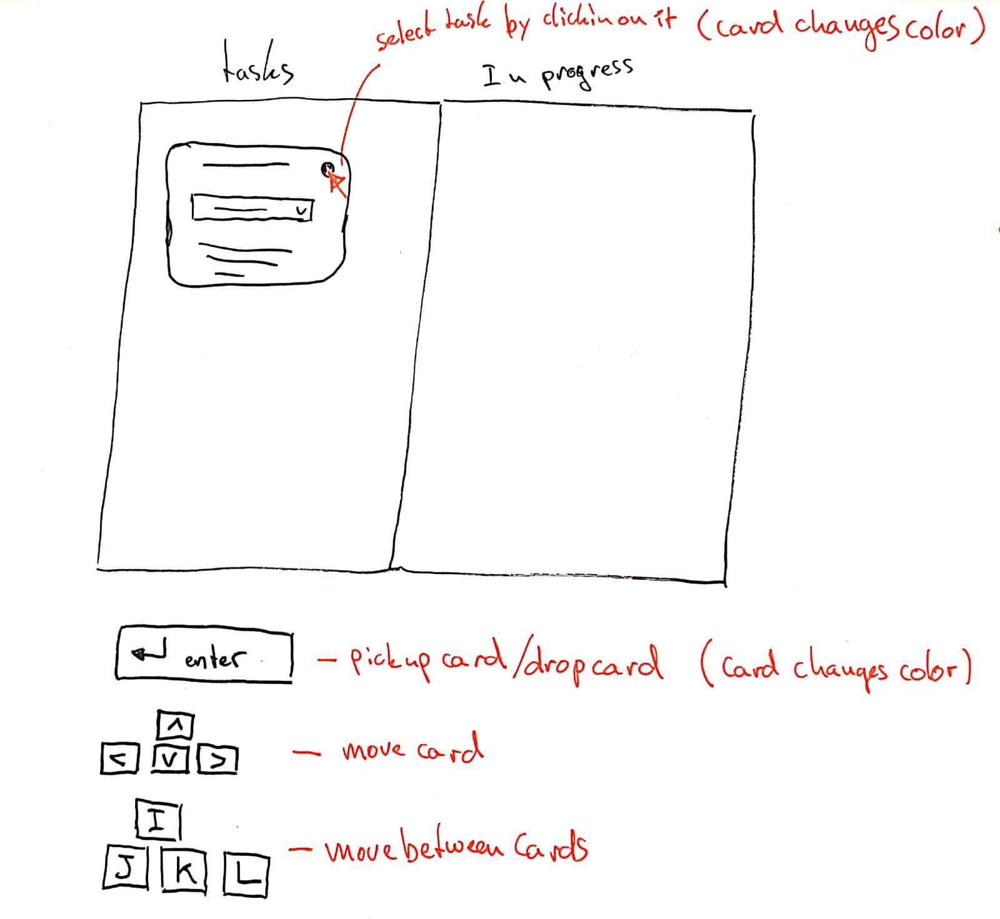

# Web Design @cmda-minor-web 1819

For this course we're going to design and make an accessible "component", like a date-picker, color-picker, or any other component that is relevant to our user. The user I'm going to design for is: Marijn Meijles. Marijn is spastic and can't use the web like the most of us.

## Table of Contents
- [Concept](#concept)
- [User Scenario](#user-scenario)
- [Test 1](#test-1-)
  - [Iteration 1](#iteration-1)
- [Test 2](#test-2)
  - [Iteration 2](#iteration-2)
- [Test 23](#test-3)
  - [Iteration 3](#iteration-3)

[DEMO](https://unruffled-curran-4c6d26.netlify.com/)

## Concept
For my concept I first looked into drag & drop. To me this seemed like a difficult task for Marijn. So I set off to build a website that is a living test plan. My different iterations are on the website. Starting off with drag & drop and finishing with two iterations of a better version of trello.

## User Scenario
I soon found out Marijn makes use of trello. While testing the website I also found out it works really bad with keyboard commands. So my application will tackle this problem. The user scenario I used will represent this problem. 

My instructions for the tests:
- Try to move the different tasks to different stadiums
- Use tabs to select the dropdowns
- Use enter/space to open the selects
- Select a stadium with the arrow keys
- Move the tasks by pressing enter
- Are there more easy ways to move the tasks?

## Test 1
#### Date: 11-04-2019
The first test day we had planned Marijn cancelled so we had a conversation with Vasilis, who knows Marijn, about his disability and the difficulties he has with using websites. Here are a few assumptions I made during this conversation:
- **He doesn't use the mouse/trackpad**
- **He uses tab to navigate through a website**

With these assumptions I started building.

### Iteration 1
The first feature was a simple drag & Drop easy to navigate with tabs and using the enter key to drag & drop the item into the other area. The second feature was a different version of trello that helps with moving tasks. It does this by having a dropdown selector where Marijn can select the stadium the task needs to move to. 

## Test 2
#### Date: 18-04-2019
This week finally get to meet Marijn and test for real. During this test some other students went before me and my drag & drop solution was shot down before it had a chance to get tested. I found that he didn't use the tab key to navigate and that he prefers to use the trackpad to navigate and select items. 

My trello solution on the other hand was still good. Marijn used it and was quite happy with how it worked. He did have a few pointers form me.
- **He expected the arrow keys to move the tasks**
- **The area for selection of the tasks was too small**
- **The focus doesn’t move with the task**

Some other points of note from the test:
- **Doesn't like to use tab to navigate**
- **Uses trackpad to navigate and select stuff**
- **Try to avoid using small keys**
- **If multiple keys are necessary make sure they are close to one another**
- **If something can be done with less keypresses make it so**
- **Make buttons etc. bigger so they are easier to press**

### Iteration 2
For the second iteration I streamlined the trello feature with my new insights from the second test. I made it so that that the tasks are movable with the arrow keys. i also made the selection of the tasks easier. You can now klick on the whole task to select it.

## Test 3
#### Date: 25-04-2019
This was the second test with Marijn, so I set to test my app on his laptop. And it didn't work... Sadly Apple has a different way to work with selectors. When you press the arrow keys when a selector is focused you open the selector. Then you have to select an option and press enter to confirm. That are a lot of keys you need to press. In windows you don't have to open the selector and you don't have to confirm your selection.

Points of note from the test:
- **Give good feedback on interactive parts of the application**
- **Provide affordance so the user doesn't have to search for interactive parts**
- **Looking for interactive parts and clicking on stuff costs a lot of concentration/energy**
- **Allow the user to select different cards with different keys(like: IJKL)**
- **Make it more clear when you have a card selected**

### Iteration 3
The third iteration will only be sketches because test 3 was only yesterday. I would like to add more options to the feature as seen in the sketch below.

