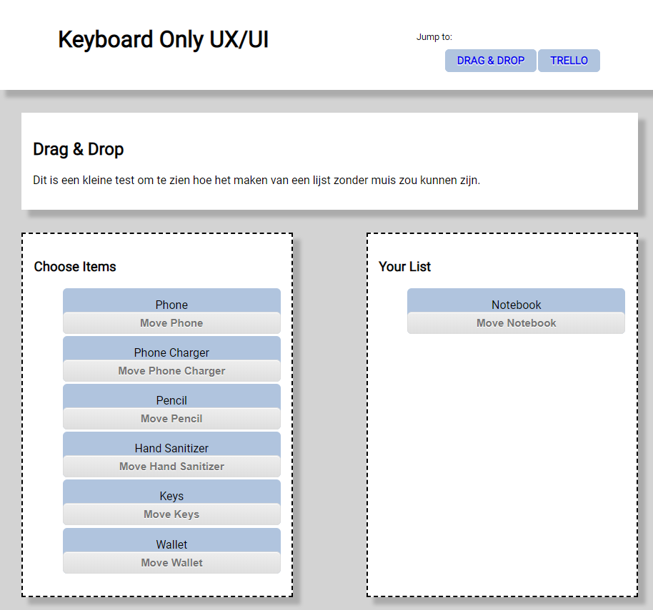
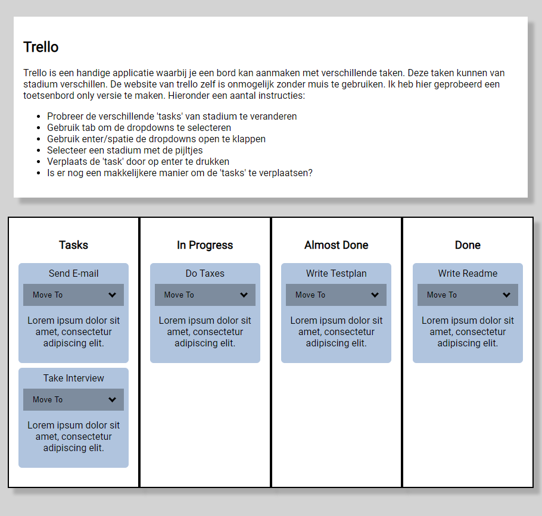
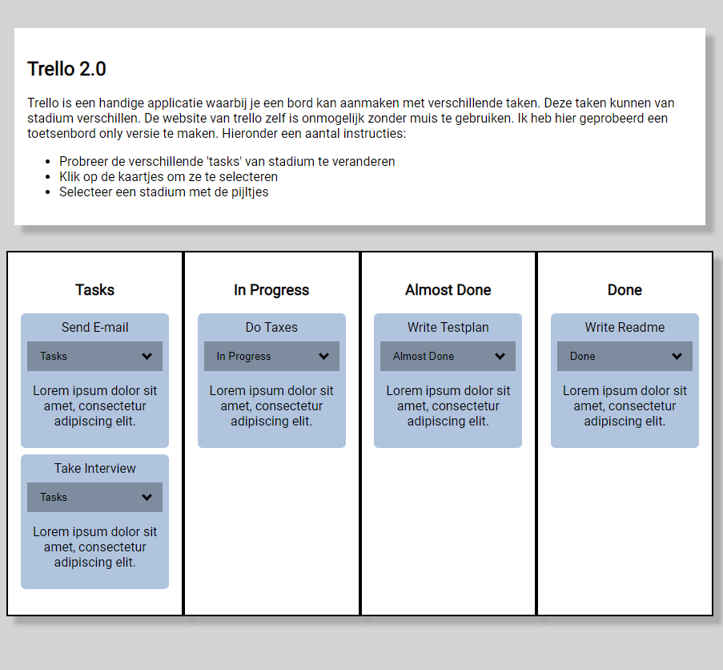

# Web Design @cmda-minor-web 1819

For this course we're going to design and make an accessible "component", like a date-picker, color-picker, or any other component that is relevant to our user. The user I'm going to design for is: Marijn Meijles. Marijn is spastic and can't use the web like the most of us.

## Table of Contents
- [Concept](#concept)
- [User Scenario](#user-scenario)
- [Test 1](#test-1-)
  - [Iteration 1](#iteration-1-)
- [Test 2](#test-2-)
  - [Iteration 2](#iteration-2-)
- [Things to Add](#things-to-add-)

[DEMO](https://unruffled-curran-4c6d26.netlify.com/)

## Concept
For my concept I first looked into drag & drop. To me this seemed like a difficult task for Marijn. So I set off to build a website that is a living testplan. My different itterations are on the website. Starting off with drag & drop and finnishing with two itterations of a better version of trello.

## User Scenario
I soon found out Marijn makes use of trello. While testing the website I also found out it works really bad with keyboard commands. So my application will tackle this problem. The user scenario I used will represent this problem. 

My instructions for the tests:
- Try to move the different tasks to different stadiums
- Use tabs to select the dropdowns
- Use enter/space to open the selects
- Select a stadium with the arrow keys
- Move the tasks by pressing enter
- Are there more easy ways to move the tasks?

## Test 1
#### Date: 11-04-2019
The first test day we had planned Marijn canceld so we had a conversation with Vasilis, who knows Marijn, about his disability and the difficulties he has with using websites. Here are a few assumptions I made during this conversation:
- **He doesn't use the mouse/trackpad**
- **He uses tab to navigate through a website**

With these assumptions I started building.

### Iteration 1
The first feature was a simple drag & Drop easy to navigate with tabs and using the enter key to drag & drop the item into the other area. The second feature was a different version of trello that helps with moving tasks. It does this by having a dropdown selector where Marijn can select the stadium the task needs to move to. 

## Test 2
#### Date: 18-04-2019
This week finally get to meet Marijn and test for real. During this test some other studens went before me and my drag & drop solution was shot down before it had a chance to get tested. I found that he didn't use the tab key to navigate and that he preferes to use the trackpad to navigate and select items. 

My trello solution on the other hand was still good. Marijn used it and was quiete happy with how it worked. He did have a few pointers form me.
- **He expected the arrow keys to move the tasks**
- **The area for selection of the tasks was too small**

Some other points of note from the test:
- **Doesn't like to use tab to navigate**
- **Uses trackpad to navigate and select stuff**
- **Try to avoid using small keys**
- **If multiple keys are nececary make sure they are close to oneanother**
- **If something can be done with less keypresses make it so**
- **Make buttons etc. bigger so they are easier to press**

### Iteration 2
Because we only had one day, I didn't get to iterate (maybe I did, but then you wouldn't be able to read this message 😮)

## Test 3
#### Date: 25-04-2019
This week, one day before the deadline we had another test-session with Marijn. I was the last one. I was worried as always that it wouldn't go well, but ... it wen't pretty great actually. When he started with looking for meme-formats, I saw that the first element (which has an automatic focus) lost focus immediately; probably due to a misclick or wrong button press. So the arrow keys didn't realy work there but he didn't really have any trouble, because they were all close together and large. Then he wen't on to add the top text, which worked, it looked like he had a bit of trouble with the arrow keys, because I think focus was lost again (but I'm not sure). He went through these steps at pretty decent pace. Moving the text worked, changing the size worked. 

The only feedback I got was from Vasilis:
- **Better defaults**

I got this feedback because the text is white by default, and you couldn't read it when the background was white. Typically meme-text is white with a black border. Also the font isn't right, the main font used in memes is Impact.

### Iteration 2
Because we only had one day, I didn't get to iterate (maybe I did, but then you wouldn't be able to read this message 😮)

---

## Things to Add
Because the test session was one day prior to the deadline, I can't do everything I have on my mind. 
The things I'd like to change are:
- A way to add more text, not just top and bottom
- Font-selection
- Ability to change colors (which was possible in my first app, which is located in this repo)
- A way to switch between editing sections using the number keys or arrows
- Easy skip-button

